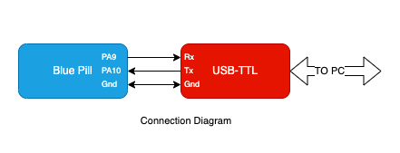
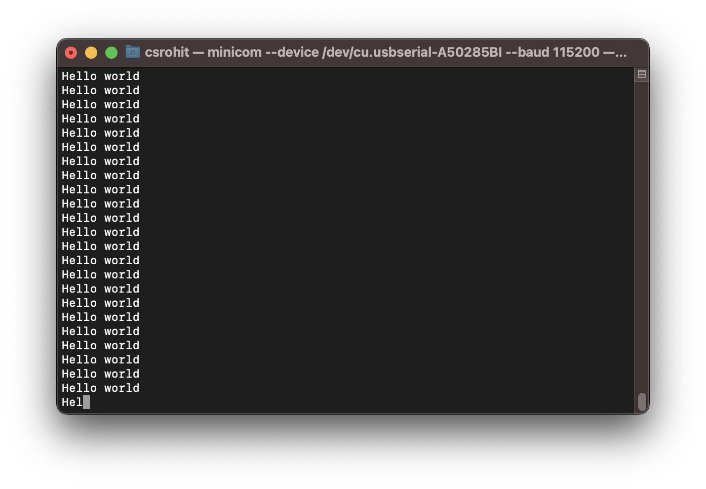

# USART communication using DMA in Circular mode

Communication between PC and STM32 using USART and DMA peripherals.

Transmit data using USART1 and DMA in continuous mode without interruption of CPU. This project does not require any IDE like CubeIde, any text editor will work including notepad, vim. For better debugging experience, VSCode is preferred.

 [](https://opensource.org/licenses/)

## Dependencies

* make
    Make utility is required for configuring and building this project. You can install make on linux by running command:

    ```bash
    # for debian based linux distros
    sudo apt install build-essential

    # for macos
    xcode-select --install
    
    # for macos using brew formulae
    brew install make
    ```

* gcc-arm-none-eabi toolchain
    ARM cross-platform toolchain is required to build applications for arm mcus. Toolchain can be installed by running following command:

    ```bash
    # for debian based linux distros
    sudo apt install gcc-arm-none-eabi

    # for macos
    brew install --cask gcc-arm-embedded
    ```

* openocd
    It is an Open On Circuit Debugging tool used to flash and debug arm micro controllers. You can install openocd on linux by running command:

   ```bash
   # for debian based linux distros
   sudo apt install openocd -y

    # for macos
    brew install openocd
   ```

* stlink-tools
    This program is required for uploading binaries to the STM32 boards. You can install stlink tools  by running the command:

    ```bash
    # for debian based linux distros
    sudo apt install stlink-tools   

    # for macos
    brew install stlink
    ```

* Cortex Debug extension
This extension for VSCode is helpful for debugging the application on Blue Pill. The contents of registers as well as memory are visible in the context menu. Launch VS Code Quick Open (Ctrl+P), paste the following command, and press enter.

```bash
ext install marus25.cortex-debug
```

## Project Structure

* `src` directory contains all source files for the project
* `include` directory contains all header files for the project

### Source file description

* `stm32f1.ld`  - linker script for stm32f103
* `src/main.c` - main application code
* `src/startup_stm32f1.c` - boot sequence for arm cortex-m3 processors
* `src/system_stm32f1xx.c` - clock configuration and system initialization functions

## Run Locally

Running the project is super easy. Just clone, build, and flash. Clone this project using **Code** button above.

### Configuration

All the configuration required for building this project is given below.

1. Build output directory
    In `Makefile`, output directory can be configured using variable `BUILD_DIR`.

2. Build type
    In `Makefile`, build type can be configured using variable`BUILD_TYPE`. Possible values are `Debug` and `Release`.

3. Binary name
    In `Makefile`, output binary name can be configured using `TARGET` variable.
    ** update the target name in the `executable` property `.vscode/launch.json` for the debugger to work.

### Build

Run following command in terminal to generate flashable binaries for blue pill board. Build files will be written to **Build Output Directory** as configured.

```bash
make
```

## Flash

1. Connect Stlink to PC and blue pill board using swd headers.
2. Put blue pill board in programming mode *(optional)*.
    The *Boot0* jumper is set to *0*, set it to *1* and reset the device.
3. Run following to flash board with binary.

```bash
make flash
```

4. Done.

## Hardware Setup

Connect the board with host through USB to TTL converter (FTDI board in our case). The connections are described as follows.

| Pin on Blue Pill  | Pin on FTDI  |
|------------------ |------------- |
| PA9               | Rx           |
| PA10              | Tx           |
| Gnd               | Gnd          |



## Output

"Hello world" messages are visible on the terminal arriving continuously dues to circular mode of operation as seen below.


## Debug

Click in `Run and Debug` option in VsCode sidebar. Then launch `Cortex Debug` target.

